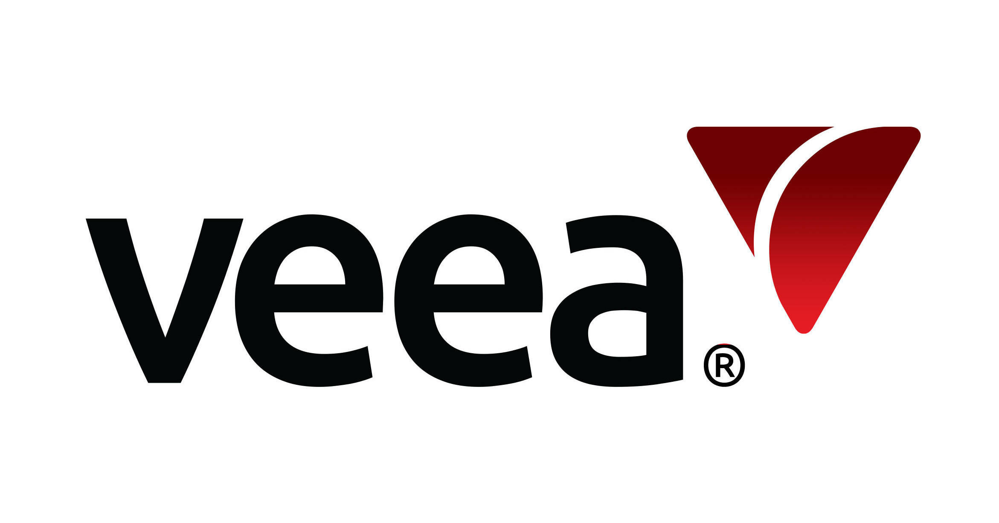

# Sayef Iqbal

### Experience
Hi, I am a Senior DevOps Engineer and a graduate student at Columbia University. As a DevOps Engineer I am responsible for managing infrastructure in AWS cloud, instrumenting applications in Kubernetes and improving CICD pipelines. I truly enjoy building applications in [Serverless](https://aws.amazon.com/serverless/) and one of my favourite applications to learn serverless is [Servelesspresso](https://serverlessland.com/reinvent2021/serverlesspresso). Apart from these, I love playing cricket and watching movies.

| | | | |
|:--:|:--:|:--:|:--:|
| </img> | [DocGo](https://www.docgo.com/) | Senior DevOps Engineer | 2023-current|
| </img> | [Veea Inc.](https://www.veea.com/) | DevOps Engineer | 2021-2023|
| </img> | [ACORD Solutions Group](https://www.acordsolutions.com/) | DevOps Engineer | 2020-2021 |
| </img> | [ACORD Solutions Group](https://www.acordsolutions.com/) | Software Developer Intern| 2020 |

### Education

| | | | |
|:--:|:--:|:--:|:--:|
| </img> | [Columbia University](https://www.columbia.edu/) | Masters in CS |
| </img> | [St. John's University](https://www.stjohns.edu/) | Bachelors in CS |

### Certification

   

### Programming Language

        

### Database

     

### DevOps

                 

### Project Management

      

### Favourite IDEs

   

<!-- 
&nbsp;
 -->

